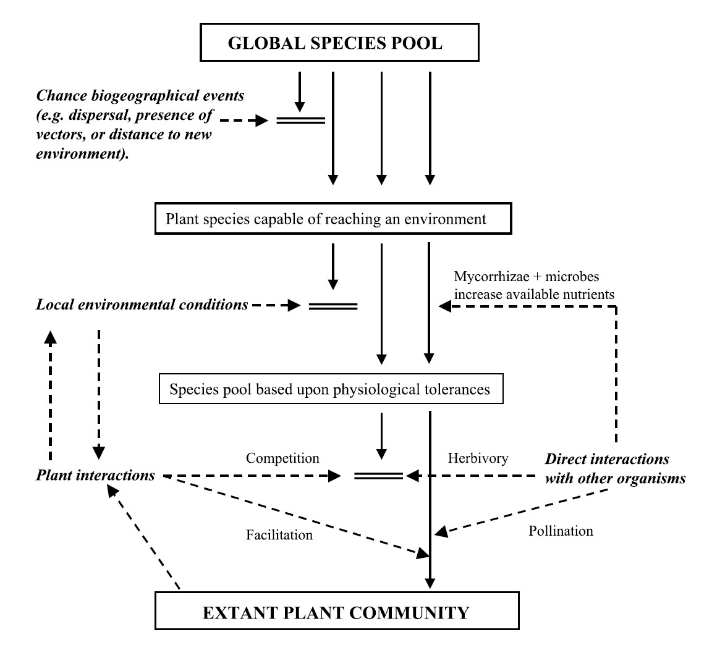
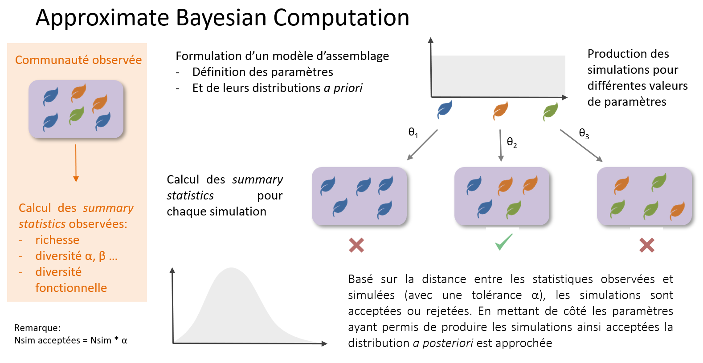

```{r setup, include=FALSE}
knitr::opts_chunk$set(echo = TRUE)
setwd("C:/Users/franc/Documents/Documents de travail/Colloques-séminaires-workshops/Statlearn")
# The analyses will rely on functions from ecolottery package
devtools::install_github("frmunoz/ecolottery/pkg")
require(ecolottery) # For community simulation and inference
require(ade4) # For prior multivariate analyses
require(abc) # For ABC inference computation
```

The code and data required for the present tutorial are available on a Github repository,https://github.com/frmunoz/ecolottery/tree/master/statlearn.

In this exercice, we will (i) simulate community assembly dynamics, (ii) use the simulations to infer assembly parameters from observed community composition data.

The community data are derived from the CESTES dataset [@jeliazkov_global_2020], and are made available on the *statlearn* Github repository .
The data are also available at https://idata.idiv.de/ddm/Data/ShowData/286?version=22.

```{r load.cestes}
load("rCESTES/CESTES.RData")
```

The analyses will be performed using the *ecolottery* package in R language [@munoz_ecolottery].
The package provides two options for simulation of community composition: (i) a "classical" foward-in-time algorithm such as death, replacement and immigration events are simulated forward in time from an initial state, (ii) a *coalescent-based* algotithm that simulate the shared co-ancestry of individuals sampled in a community at present time, depending on the *past* death, replacement and immigration events [@etienne_dispersal-limited_2005,@munoz_how_2014].

# Conceptual framework of community assembly

A common conception is that a set of filters selects the individuals that can establish, survive, and be observed in a community. The filters play on a set of potential immigrants representing a regional species pool [@lessard_inferring_2012]. The filters then depend on (i) dispersal ability, (ii) adaptation to local environmental conditions, and (iii) ability to survive under local biotic interactions [@lortie_rethinking_2004].



# Community simulation

In the following, we will simulate communities including J = 100 individuals.

```{r com.size}
J <- 100
```

Before simulating communities, we need  to define a reference (regional) pool from which immigrants are drawn. In the following example, the user provides a custom species pool including 500 species with equal abundances.

```{r pool}
Jpool <- 50*J
pool <- cbind(1:Jpool,rep(1:500,Jpool/500))
```

The user can include in *pool* the values of one or several (functional) traits for each individual of the species pool, or provide a separate *traits* data frame including the values of one or several traits for each species. 

```{r pool.trait.runif}
# With uniform trait values in the species pool
pool <- cbind(1:Jpool, rep(1:500, Jpool/500), runif(Jpool))
```

The functional trait values can also be defined as a species average with some intraspecific variation.

```{r pool.trait.intra}
t.sp <- runif(500)
names(t.sp) <- as.character(1:500)

# Gaussian intraspecific variation with standard deviation = 0.01
for(i in 1:500) pool[pool[,2] == i, 3] <- rnorm(sum(pool[,2]==i), 
                                                mean = t.sp[i], sd = 0.01)
```

## Dispersal limitation

Not all species of the regional pool can disperse into a focal local community.

We define as *m* the probability that an individual of the pool migrates to the community.
In a simple case of neutral dispersal dynamics, *m* is constant and holds for all species.

In the following example, we examine the species relative abundances of the simulated community.

```{r comm.disp.neut}
m <- 0.1

# Community assembly with neutral dispersal limitation
com1 <- coalesc(J, m = 0.1, pool = pool)
table(com1$com$sp)
```

## Environmental filtering

The user can define an environmental filtering function determining the probability that individuals from the reference pool successfully immigrate in the community, depending on the functionak trait value(s).

In the following example, the filtering function is Gaussian with mean *t* and standard deviation 0.1 [stabilizing filtering, @shipley_measuring_2013]. 

```{r}
sigma <- 0.1
filt_gaussian <- function(t,x) exp(-(x-t)^2/(2*sigma^2))
```

We simulate a community undergoing stabilizing environmental filtering around *t = 0.5*.  
The function $plot_comm$ displays the distribution of trait values in the simululated community, compared to the trait distribution in the regional pool providing the immigrants.

```{r}
com2a <- coalesc(J, m, filt = function(x) filt_gaussian(0.5, x), pool = pool)
plot_comm(com2a, main = "Stabilizing filtering around t = 0.5")
```

We can also simulate stabilizing environmental filtering around *t = 0.1* and *t = 0.9*.

```{r}
J <- 500; m <- 0.5; 
com2b <- coalesc(J, m, filt = function(x) filt_gaussian(0.1, x), pool = pool)
plot_comm(com2b, main = "Stabilizing filtering around t = 0.1")
com2c <- coalesc(J, m, filt = function(x) filt_gaussian(0.9, x), pool = pool)
plot_comm(com2c, main = "Stabilizing filtering around t = 0.9")
```

When stabilizing filtering operates around different optimal values among communities, we expect corresponding changes in the local mean trait values [@cornwell_community_2009].

```{r}
mean(com2a$com[, 3])
mean(com2b$com[, 3])
mean(com2c$com[, 3])
```

Different filtering functions can be designed to represent different types of environmental filtering. By analogy with selection regimes in evolutionary theory [@shipley_measuring_2013]], we can define the outcome of directional and disruptive filtering functions.

```{r}
# Directional environmental filtering toward t = 0
com2d <- coalesc(J, m, filt = function(x) 1 - min(x,1), pool = pool)
plot_comm(com2d, main = "Directional filtering")

# Disruptive environmental filtering around t = 0.5
com2e <- coalesc(J, m, filt = function(x) abs(0.5 - x), pool = pool)
plot_comm(com2e, main = "Disruptive filtering")
```

Disruptive filtering here represents the greater success of species with trait values away from *t = 0.5*. It corresponds to a separation of ecological groups in the community, and represents a form of niche differentiation (Vergnon et al. 2009).

## Forward-in-time simulation

The *ecolottery* package also includes a function *forward* to perform simulation of community dynamics from an initial composition.
As for *coalesc*, the user can define the composition of the species pool from which immigrants are drawn, and can specify environmental filtering based on one or several traits.

We can for instance simulate stabilizing environmental filtering in a way analogous to the previous example with *`coalesc()`*. *`d = 10`* represents the number of individuals that die in the community at each time step, *`prob = 0.5`* represents the immigration rate at each time step. The number of simulated time steps is *`gens = 500`*.

```{r, message = F, eval = F}
# Initial community composed of 500 individuals
initial <- data.frame(ind = paste("init", 1:J, sep="."), sp = rep(as.character(1:50),J/50), 
                   tra = rep(NA,J), stringsAsFactors=F)
initial$tra <- t.sp[initial$sp]

# Forward-in-time simulation 
sigma <- 0.1
filt_gaussian <- function(t,x) exp(-(x-t)^2/(2*sigma^2))
final.envfilt <- forward(initial = initial, m = 0.25, d = 10, gens = 500, 
                         pool = pool, filt = function(x) filt_gaussian(0.5,x))

plot_comm(final.envfilt)
```

A specific advantage of `forward()` is to simulate the sequence of community assembly events over time. If the birth, death and immigration probabilities depend on community composition at a specific time, the coalescent-based approach may not be appropriate. 

In the following example, community dynamics with limiting similarity are simulated.
In this case, the probability of individual death depends on the similarity of trait values of each individual to the other individuals of the community.

```{r, message = F, eval = F}
final.limsim <- forward(initial = initial, m = 0.25, d = 10, gens = 1000,
                 pool = pool, keep = F, limit.sim = T, coeff.lim.sim = 1)

plot(final.limsim$dist.t, xlab = "Time", ylab = "Average distance to other individuals")
init.dist <- matrix(dist(initial$tra))
diag(init.dist) <- NA
abline(mean(init.dist, na.rm=T), 0, col="red")
plot(final.limsim$sp_t, xlab = "Time", ylab = "Richness")
abline(length(unique(initial$sp)), 0, col = "red")
```

The first figure represents the temporal trajectory of the average distance of each individual to the other individuals of the community. The distance fluctuates and increases over time due to the influence of limiting similarity. The second figure shows the variation of richness, basically decreasing due to limiting similarity, until reaching stationarity.

# The alpine plant community dataset

We will analyze data from alpine plant communities spanning a mesotopographical gradient [@choler_consistent_2005]. It includes 75 communities with 82 plant species.

```{r get.choler}
data <- LSmatred$Choler2005
```

Prior to inference of community assembly parameters, we first perform a multivariate analysis of the environmental and functional trait data.

```{r choler.trait.pca}
trait.pca <- dudi.pca(data$traits, scannf=F, nf=ncol(data$traits))
s.arrow(trait.pca$co)
barplot(trait.pca$eig)
```
The two first dimensions of the analysis represent: (i) a leaf "economics" on abscissa, i.e., a gradient from species that acquire resources through photosynthesis more quickly (with high SLA and high concentration of N in leaves) to more conservative strategies (leaves that acquire resources less quickly but survive longer), (ii) a stem "economics" on ordinates, i.e., a gradient from smaller species that spread mostly laterally to taller species with higher evapotranspiration (greater leaf area).
We note that these two basic dimensions are consistent with the two main dimensions of plant functional strategies worldwide [@diaz_global_2016].

```{r choler.env.mix}
env.mix <- dudi.mix(data$envir, scannf=F, nf=ncol(data$envir))
s.arrow(env.mix$co)
barplot(env.mix$eig)
```
The abscissa represent a gradient of snow cover duration, from steeper locations with shorter snow cover to talwegs with longer snow cover.
The ordinates represent a gradient of zoogenic disturbance, i.e., of unvegetated soil due to marmot activity.

In the following, for the sake of simplicity, we will infer environmental filtering playing on the leaf acquisition trait functional dimension along a gradient of snow cover.
The fundamental hypothesis is that the longer is snow cover, the shorter if the time left for plant development, which should select more acquisitive strategies.

We can first examine the relationship between the average of species scores on the leaf acquisition trait dimension in communities (COmmunity Weighted Mean, CWM), according to the snow cover gradient.

```{r cwm.snow}
cwm.leaf <- data$comm%*%trait.pca$li[colnames(data$comm),1]/rowSums(data$comm)
plot(cwm.leaf~env.mix$li[rownames(data$comm),1])
```

Communities including plants with more acquisitive leaves are found in situations with longer snow cover.

We then define the global pool of species including all the species of the dataset along with their coordinates on the abscissa of the multivariate analysis of functional traits

```{r choler.pool}
pool <- data.frame(ind = as.character(1:sum(data$comm)), sp = rep(colnames(data$comm),colSums(data$comm)), tr = rep(trait.pca$li[colnames(data$comm),1],colSums(data$comm)))
```

```{r choler.env}
env <- data.frame(enc = env.mix$li[rownames(data$comm),1])
```

## ABC-based inference of community assembly parameters

Approximate Bayesian Computation (ABC) is a method of inference of the parameter values from observed data for a given model [@csillery_approximate_2010]. It draws parameter values in prior distributions of the parameters and perform simulations of the model for each set of parameter values. Summary statistics are calculated to characterize the observed data and the simulated patterns. The closer the simulated summary statistics are to the observed statistics, the more plausible the parameter values of these simulations are. We thus derive posterior distributions of the parameter values based on how close the summatry statistics are to the observed statistics.




```{r abc.init}
# Trait-dependent filtering function
filt_gaussian_env <- function(t, par, env) exp(-(t-par[1]*env-par[2])^2/(2*par[3]^2))

# Definition of parameters of this function and their range
par.range <- data.frame(rbind(c(-1, 1), c(-1, 1), c(0.01, 2)))
row.names(par.range) <- c("a", "b", "sigmaopt")

# Basic summary statistics describing local community composition
f.sumstats <- function(tab, traits) array(dimnames=
  list(c(paste(rep("cwm",nrow(tab)),1:nrow(tab)), paste(rep("cwv",nrow(tab)),1:nrow(tab)), 
  paste(rep("S",nrow(tab)),1:nrow(tab)), paste(rep("Es",nrow(tab)),1:nrow(tab)))),
  c(apply(tab, 1, function(x) Weighted.Desc.Stat::w.mean(traits[colnames(tab),], x)), 
  apply(tab, 1, function(x) Weighted.Desc.Stat::w.var(traits[colnames(tab),], x)), 
   apply(tab, 1, function(x) sum(x!=0)),
  apply(tab, 1, vegan::diversity)))
```

Then we perform ABC estimation of the parameters of filtering and migration based on observed community composition.

```{r abc.sim.single, eval=F}
# Number of values to sample in prior distributions
nb.samp <- 10000 # Should be large

filt_gaussian <- function(t,par) exp(-(par[1]-t)^2/(2*par[2]^2))

par.range <- data.frame(rbind(c(-1, 1), c(0.05, 1)))
f.sumstats <- function(com) array(dimnames=list(c("cwm", "cwv", "cws",
                                                  "cwk", "S", "Es")),
                                  c(mean(com[,3]), var(com[,3]), 
                                    e1071::skewness(com[,3]),  
                                    e1071::kurtosis(com[,3]),
                                    vegan::specnumber(table(com[,2])),
                                    vegan::diversity(table(com[,2]))))

res.tab <- list()
for(i in 1:nrow(data$comm))
  res.tab[[i]] <- coalesc_abc(data.frame(ind=1:sum(data$comm[i,]),sp=rep(colnames(data$comm),data$comm[i,]),tr=trait.pca$li[rep(colnames(data$comm),data$comm[i,]),1]), pool, multi = "single", f.sumstats = f.sumstats,
                   filt.abc = filt_gaussian, filt.vect = T, par.filt = par.range, 
                   nb.samp = nb.samp, parallel = TRUE, tol = 0.5, method.abc = "neuralnet",
                   pkg = c("vegan","Weighted.Desc.Stat"))

```

```{r load.choler.res}
# Get the results from a previous run
load("res.tab.Choler.RData")

plot(res.tab[[1]]$abc, param=res.tab[[1]]$par)
```

```{r env.topt, eval=F}
plot(env[,1],unlist(lapply(res.tab, function(x) mean(x$abc$unadj.values[,1]))))
```

```{r abc.cv, eval=F}
res.tab1.cv  <- cv4abc(res.tab[[1]]$par, res.tab[[1]]$ss,nval=500,tols=c(0.1,0.25,0.5),method="neuralnet")
```

```{r abc.cv.plot}
load("res.tab1.cv.Choler.Rdata")
plot(res.tab1.cv)
```

